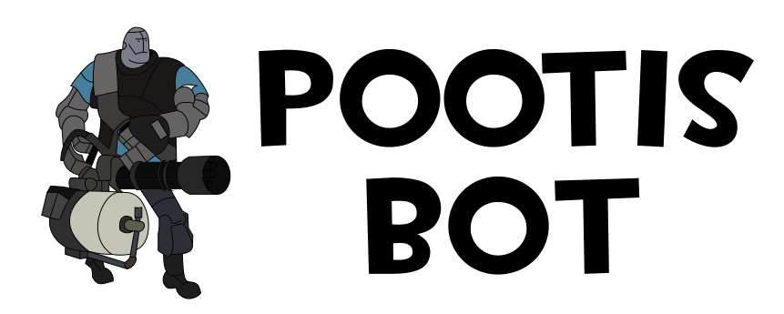

 

Pootis-Bot, a multipurpose, modular, open-source Discord bot written in the C# language using [Discord.NET](https://github.com/discord-net/Discord.Net).

# Bot Features

Due to modular design of Pootis-Bot, any number of features could be added to Pootis.

The bot by default comes with a few modules, theses modules can of course be removed.

## Included Modules

- Basic Bot Stuff 
    - (Hello, ping, help, etc)
- AutoVC
    - Allows for a voice channel to automatically create smaller sub chats
- Profiles
    - XP, levels
- Reminders
    - Remind you about stuff
- Rule Reaction
    - Require a message to be reacted to gain entry
- Welcome & Goodbye Message
    - Set a custom welcome and goodbye message for when your users join and leave
- Permissions
    - Set permissions on any bot command.

## Getting Started

**I will not host the bot for you! You will need to host it your self to have it on your own Discord server!** Read about hosting [here](https://pootis-bot.voltstro.dev/hosting/).

Currently, this bot is under going a complete re-write. This will mean that once v2 is out, support for v1.x will not be given anymore, however any major fixes (such as Discord.Net updates) that are required will be given to v1.x while v2 is in the works. Any PRs that include major new features will not be accepted!

V2 will include major breaking changes (as its a re-write), but will make the bot, and its code 1000 times better.

### Downloading

### Stable

Stable builds can be found [here](https://github.com/Voltstro/Pootis-Bot/releases).

### Preview

Preview builds offer the most bleeding-edge version of Pootis-Bot. As such, it may have breaking or in-the-work changes.

You can find the preview builds uploaded as [artifacts on the DevOps page](https://dev.azure.com/Voltstro/Pootis-Bot/_build?definitionId=3).

### Contributing

1. First read [CONTRIBUTING.md](/CONTRIBUTING.md) and [CODE_OF_CONDUCT.md](/CODE_OF_CONDUCT.md).

2. Fork the project

3. Clone your fork to your local machine

4. Visit the [Pootis-Bot documentation](https://pootis-bot.voltstro.dev/dev/building/) which will show you how to use the powershell scripts, or how to compile with the `dotnet` command.

## Authors

* **Voltstro** - *Initial work* - [Voltstro](https://github.com/Voltstro)

## License

This project is licensed under the MIT License - see the [LICENSE.md](https://github.com/Voltstro/Pootis-Bot/blob/master/LICENSE.md) file for details

## Quick Notes

* We all know that there is a crap tone of open-source Discord bots, many of which are either made for one server, or just as a hobby. Pootis is no exception to both of theses, it was designed for my crappy Discord server, but turned into something that I worked on the side as a hobby.