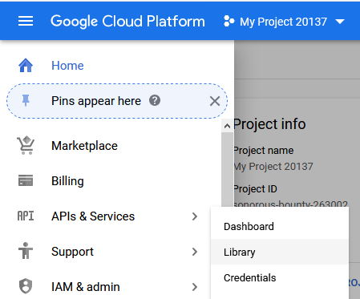
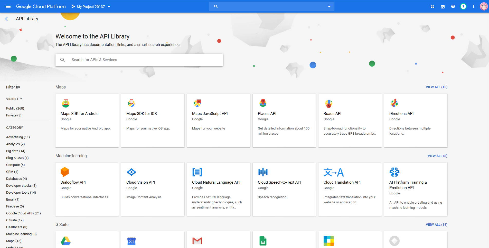
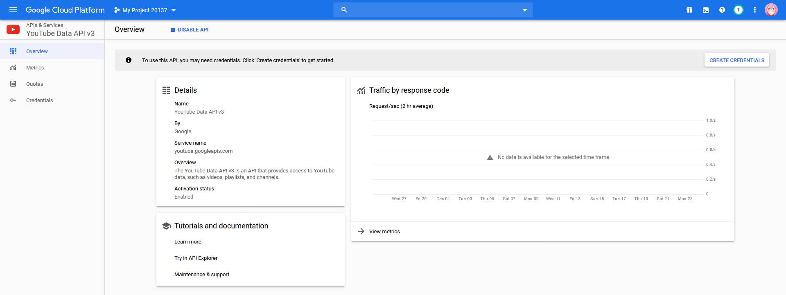
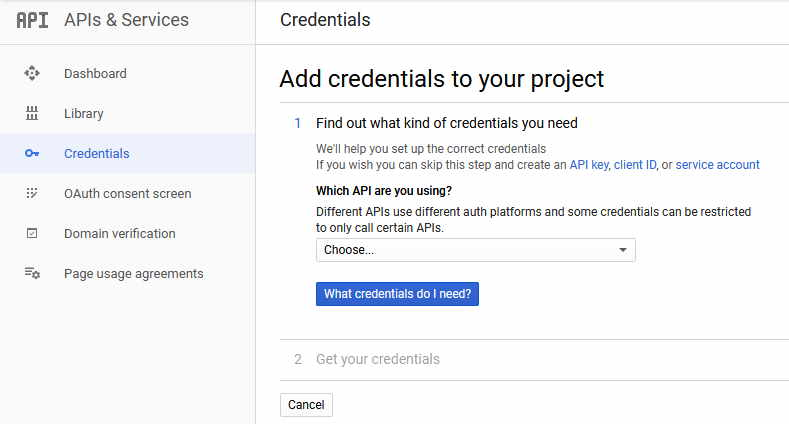
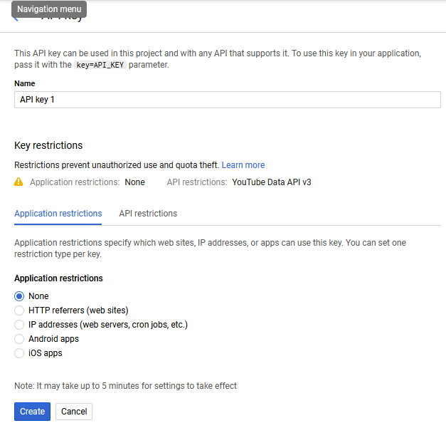
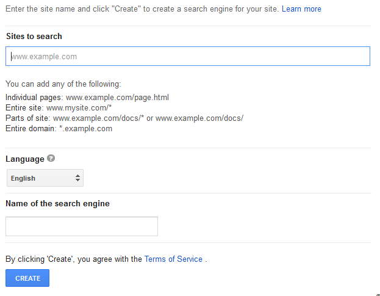

# Setting up Google/YouTube API Keys

Getting the API keys for Google and YouTube can be quite confusing at first. This guide will show you how to get API keys for both Google and YouTube.

!!! warning
    NEVER GIVE YOUR API KEY TO ANYONE YOU DON'T REALLY TRUST!

## Prerequisites

```bash
Google Account
```

## Setting up the Project

First, head over to [Google Cloud Platform](https://console.cloud.google.com/). You will land on a page that looks like this:


Then click on 'Select a project'(top left) and then 'New Project'(top right). You will be on a page like this:


Give it a name and click 'Create'!

It will take a moment to create the project, you can see when it is ready in the notifications in the top right.

## Adding an API to the project

### YouTube API Key Setup

!!! info
    New versions of Pootis-Bot (Anything above 1.1) do not require a YouTube API key. All you need to enable YouTube services now is to enable under the API section in the config menu.

    You can safely [skip this step](#google-search-api-setup).

Setting up YouTube search for Pootis-Bot is pretty easy.

First, open up the side bar, hover on 'APIs & Services', then click 'Library'.



You should arrive at a page that looks like this:



Search or find 'YouTube Data API v3', and enable it for your project. Once it is enabled it should take you to a page that looks like this:



Up in the top right corner, there should be a button 'Create Credentials', click that button. It will take you to this page:



Click on the little hyperlink that says 'API key'. Its in the first sentence. It will take you here:



Give your API a name, and under 'API restrictions', add 'YouTube Data API v3'. Then click 'Create'. You should be able to get the ket itself under the 'API Keys' on the page it redirects you to once you click 'Create'.

### Google Search API Setup

Setting up Google search can take a little longer, because we will need to create a custom Google search engine.

First, start by following the same steps for the YouTube API creation, except instead of using 'YouTube Data API v3', use 'Custom Search API'.

#### Google Search Engine ID

Once you have your Custom Search API key, visit [this page](https://cse.google.com/cse/). Once you are there, click 'Create a custom search engine' in the top right corner. You will be at this form: 



In the sites to search, give it a random site (we will change it later to search the entire web).

Give your search engine a name, and click 'Create'.

You will be on a new page after that, click on something like Control Panel. You need to get to these settings:


At the bottom of the settings, enable 'Search the entire web', and remove your temp site from the list of sites to search.

You can see your search engine ID, at the top of the page under 'Search engine ID'(duh).

## Done!

By the end of this, you should have your:

- YouTube Search API Key

- Google Custom Search API Key

- Google Search Engine ID

You can put theses into your config now.