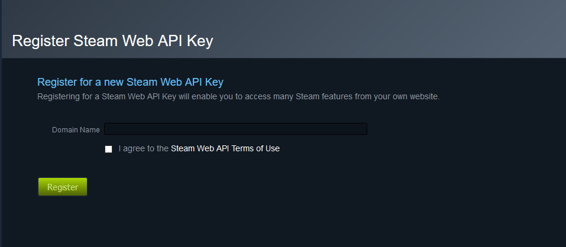

# Steam API Key

Getting a Steam API Key is pretty easy.

!!! warning
    NEVER GIVE YOUR API KEY TO ANYONE YOU DON'T REALLY TRUST!

## Prerequisites

```
Steam Account
```

## Getting a Steam API Key

First, head to [Register Steam Web API Key](https://steamcommunity.com/dev/apikey) page.

You will arrive on this page:



In the Domain Name, put your domain name in. If you don't have a domain you can put `127.0.0.1`

Click 'Register' and you will have your Steam API Key.

## Done!

You now have your Steam API Key, you can now set it in your config.