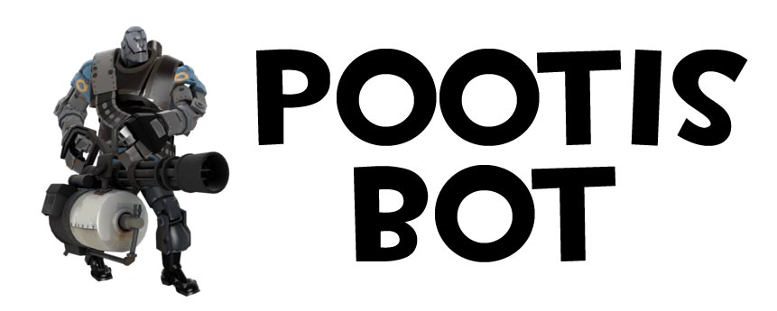

# Pootis-Bot
 

 

Welcome to the Pootis-Bot docs!

Pootis-Bot is an open-source C# Discord bot, built using [Discord.Net](https://github.com/discord-net/Discord.Net) and .NET Core. This project is licensed under the [MIT license](https://github.com/Voltstro/Pootis-Bot/blob/master/LICENSE.md).

Hopefully everything you need to know is here! If you have any questions please don't be scared to ask in the [Voltstro Discord Server](https://discord.voltstro.dev).

## Bot Features

Some current features that the bot can do. More feature are planed to be added in the future!

- Multi Server Capabilities

- Moderation

- User Accounts

- Leveling system

- Music Service (Downloads from YouTube)

- Google, YouTube, Giphy, Wikipedia and Steam user search support

- [Rule reaction feature](https://pootis-bot.voltstro.dev/server-setup/rulereaction/)

- [Auto Voice Channels](https://pootis-bot.voltstro.dev/server-setup/auto-vc/)

- [Basic Anti-Spam features](https://pootis-bot.voltstro.dev/server-setup/anti-spam/)

- Cross-Platform (Windows, Linux, MacOS)

## Getting Started

!!! note
    **I will not host the bot for you, you will have to host the bot yourself!** 

    If you want to host it yourself, read the guide under the '[Bot Hosting](hosting/)' section of the docs.

If you want to host the bot your self for public use you can, you can really do anything you want with this bot or the source-code, as long as it follows the [license](https://github.com/Voltstro/Pootis-Bot/blob/master/LICENSE.md), though originally Pootis-Bot was designed for **MY** server, however the scope of this project has grown larger then just that.

I would also quickly like to note that this is the first piece of software that I have publicly released, there are bound to be mistakes and pieces of code that aren't "professional" or whatever, if you see a piece of code in the source-code that could be improved, please [open up a PR](https://github.com/Voltstro/Pootis-Bot/pulls) with a reason on why your improve is better.

## Quick Links

Here are some quick links:

- [Pootis-Bot Discord commands](commands/discord-commands/)
- [Setup Pootis-Bot for your server](server-setup/)

### Development / Hosting links

- [Download](download/)
- [Pootis-Bot Install and Hosting](hosting/)
- [Building Pootis-Bot for yourself](dev/building/)