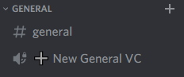

# Auto Voice Channels

## What are auto voice channels?

Auto voice channels is a system where users can create new channels, however they still full under the same category as the main channel. It is desgined to help keep the channel list from not looking like:
```
General Chat #1
General Chat #2
General Chat #3
...
```

This is what a auto VC channel initially looks like.



And when you connect to one it then looks like this:


So as you can, when a user joins the chat, it creates a new one, and moves the user to that chat. Other users can choose to create a new VC chat, or join a pre-existing one with people in it.

After there is no one else in the chat, it will get deleted.

### Video showcase

See here: [https://youtu.be/5i8Ihz0fqKw](https://youtu.be/5i8Ihz0fqKw)

## How to setup

To create an auto voice channel is easy, run the command:

```
addvcchannel [Base Name]
```

It will then add a voice channel and you can move it to were ever you want it to be!

To delete it, just delete it like a normal voice channel.